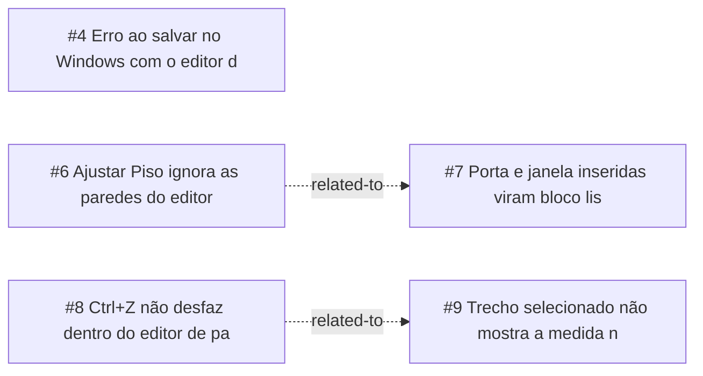

<!-- GENERATED, DO NOT EDIT: regenerado por /reversa-debugger-graph em 2026-10-07T14:33:37+00:00 a partir de 5 bugs -->

# Grafo · editor-de-paredes

## Clusters

- `wall_editor`: BUG-20261006-KFAR, BUG-20261007-VQ72, BUG-20261007-ZZUK
- `operators`: BUG-20261007-A2G7, BUG-20261007-YIMY

## Impact score

Heurística de triagem (não substitui priority/severity): só arestas supported/confirmed contam.

- BUG-20261006-KFAR: 0
- BUG-20261007-YIMY: 0
