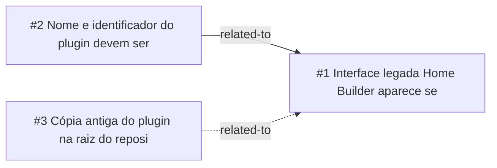

<!-- GENERATED, DO NOT EDIT: regenerado por /reversa-debugger-graph em 2026-10-07T14:21:19+00:00 a partir de 3 bugs -->

# Grafo · plugin-caffmob-draw

## Clusters

- `ui`: BUG-20261006-NO4Q
- `hb_core`: BUG-20261006-QAVK, BUG-20261006-SCVF

## Impact score

Heurística de triagem (não substitui priority/severity): só arestas supported/confirmed contam.

