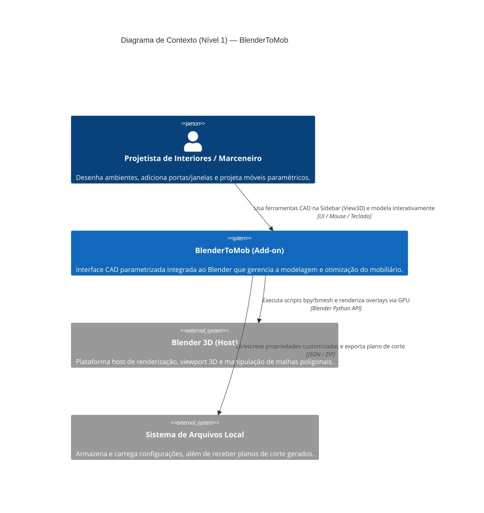
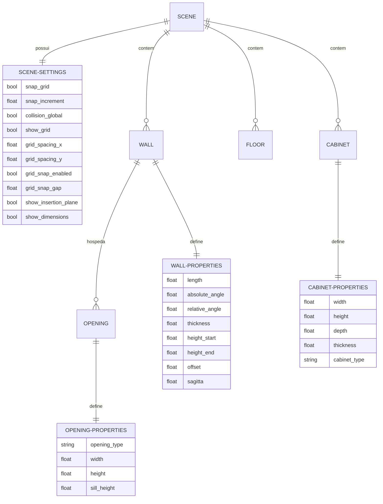

# Visão Geral da Arquitetura — BlenderToMob

Este documento apresenta a especificação arquitetural do sistema **BlenderToMob**, documentada pelo agente **Architect** na fase de Geração.

---

## 1. Visão Geral do Sistema

O **BlenderToMob** é um add-on modular e parametrizado para o Blender 4.2+ (Python 3). Ele segue uma arquitetura orientada a serviços e dados, desacoplada em responsabilidades bem delimitadas. A integração com o Blender se dá por registro dinâmico na API `bpy`.

```
                  ┌────────────────────────────────────────┐
                  │          Blender 3D Viewport           │
                  └──────────────────┬─────────────────────┘
                                     │
                                     ▼
         ┌────────────────────────────────────────────────────────┐
         │                  BlenderToMob UI                       │
         │   (Panels na Sidebar: Environment, Cabinet, Nesting)   │
         └──────────────────────────┬─────────────────────────────┘
                                     │
                                     ▼
         ┌────────────────────────────────────────────────────────┐
         │             Operators (wall, cabinet, openings)        │
         │           (Modal states, snaps, click inputs)          │
         └──────────────────────────┬─────────────────────────────┘
                                     │
                     ┌───────────────┴───────────────┐
                     ▼                               ▼
       ┌───────────────────────────┐   ┌───────────────────────────┐
       │   geometry / mesh_gen     │   │     cutting / nesting     │
       │ (bmesh modeling algorithms)│   │ (bin-packing optimization)│
       └─────────────┬─────────────┘   └───────────────────────────┘
                     │
                     ▼
       ┌───────────────────────────┐
       │     data / properties     │
       │(bpy Custom Property Groups)│
       └───────────────────────────┘
```

---

## 2. Diagrama de Contexto (Mermaid C4)



---

## 3. Modelo de Entidades e Relacionamentos (ERD)

Abaixo está o diagrama ERD simplificado mapeando as entidades paramétricas registradas no Blender e suas relações lógicas de negócio:



---

## 4. Dívidas Técnicas e Lacunas Identificadas

* **Ausência de Testes Automatizados (D-01)**: Mapeamento de 0 arquivos de testes unitários ou de integração na suite atual.
* **Complexidade Cíclica no Raycast da Viewport (D-02)**: O loop modal de aberturas recalcula a distância ponto-segmento 2D contra todas as paredes da cena a cada movimento do mouse (`MOUSEMOVE`), o que pode degradar performance em layouts massivos (com centenas de paredes). Um algoritmo de divisão espacial (ex: Quadtree ou KD-Tree) seria mais escalável a longo prazo.
* **Dificuldade de Desfazer Operações Complexas (D-03)**: A inserção de abertura cria o modificador boolean e o cortador. Embora exista o operador `BTM_OT_RemoveOpening`, a exclusão manual do objeto cortador no Blender sem o operador apropriado deixa o modificador boolean quebrado/órfão na parede.

---

## 5. Escala de Confiança

* **Arquitetura Geral**: 🟢 CONFIRMADO (Mapeado diretamente do registro de módulos em `__init__.py`).
* **Estrutura ERD**: 🟢 CONFIRMADO (Correspondência exata aos PropertyGroups registrados em `data/properties.py`).
* **Dívidas Técnicas**: 🟢 CONFIRMADO (Inferência baseada na leitura do código de loops modais e falta de testes).
