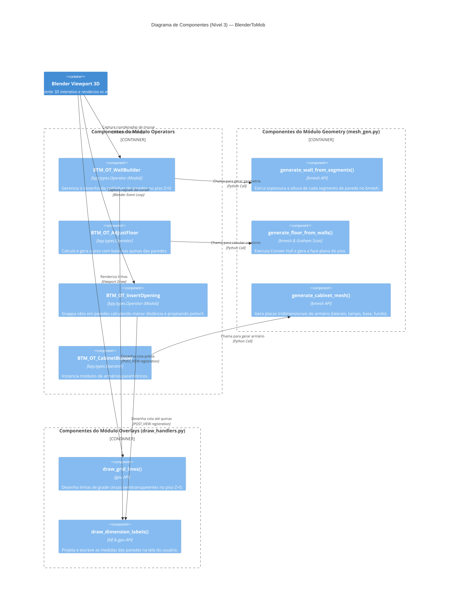

```mermaid
C4Component
    title Diagrama de Componentes (Nível 3) — BlenderToMob

    Container(viewport, "Blender Viewport 3D", "Visualiza o ambiente 3D interativo e renderiza os overlays gráficos.")
    
    Container_Boundary(operators, "Componentes do Módulo Operators") {
        Component(wall_op, "BTM_OT_WallBuilder", "bpy.types.Operator (Modal)", "Gerencia o desenho de polilinhas de paredes no piso Z=0.")
        Component(floor_op, "BTM_OT_AdjustFloor", "bpy.types.Operator", "Calcula e gera o piso com base nas quinas das paredes.")
        Component(open_op, "BTM_OT_InsertOpening", "bpy.types.Operator (Modal)", "Snappa vãos em paredes calculando menor distância e projetando peitoril.")
        Component(cabinet_op, "BTM_OT_CabinetBuilder", "bpy.types.Operator", "Instancia módulos de armários paramétricos.")
    }

    Container_Boundary(geometry, "Componentes do Módulo Geometry (mesh_gen.py)") {
        Component(mesh_wall, "generate_wall_from_segments()", "bmesh API", "Extrui espessura e altura de cada segmento de parede no bmesh.")
        Component(mesh_floor, "generate_floor_from_walls()", "bmesh & Graham Scan", "Executa Convex Hull e gera a face plana do piso.")
        Component(mesh_cab, "generate_cabinet_mesh()", "bmesh API", "Gera placas tridimensionais do armário (laterais, tampo, base, fundo).")
    }

    Container_Boundary(overlays, "Componentes do Módulo Overlays (draw_handlers.py)") {
        Component(grid_draw, "draw_grid_lines()", "gpu API", "Desenha linhas de grade cinzas semitransparentes no piso Z=0.")
        Component(cota_draw, "draw_dimension_labels()", "blf & gpu API", "Projeta e escreve as medidas das paredes na tela do usuário.")
    }

    Rel(viewport, wall_op, "Captura coordenadas de mouse", "Blender Event Loop")
    Rel(viewport, open_op, "Captura raycast de cursor", "Blender Event Loop")

    Rel(wall_op, mesh_wall, "Chama para gerar geometria", "Python Call")
    Rel(floor_op, mesh_floor, "Chama para calcular contorno", "Python Call")
    Rel(cabinet_op, mesh_cab, "Chama para gerar armário", "Python Call")

    Rel(wall_op, cota_draw, "Desenha cota prévia", "POST_VIEW registration")
    Rel(open_op, cota_draw, "Desenha cota até quinas", "POST_VIEW registration")
    Rel(viewport, grid_draw, "Renderiza linhas", "Viewport Draw")
```
