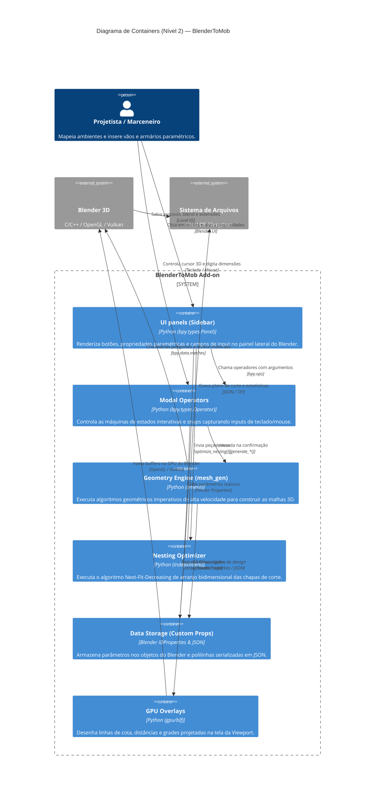

```mermaid
C4Container
    title Diagrama de Containers (Nível 2) — BlenderToMob

    Person(designer, "Projetista / Marceneiro", "Mapeia ambientes e insere vãos e armários paramétricos.")
    
    System_Boundary(addon, "BlenderToMob Add-on") {
        Container(ui_panels, "UI panels (Sidebar)", "Python (bpy.types.Panel)", "Renderiza botões, propriedades paramétricas e campos de input no painel lateral do Blender.")
        Container(modal_ops, "Modal Operators", "Python (bpy.types.Operator)", "Controla as máquinas de estados interativas e snaps capturando inputs de teclado/mouse.")
        Container(mesh_gen, "Geometry Engine (mesh_gen)", "Python (bmesh)", "Executa algoritmos geométricos imperativos de alta velocidade para construir as malhas 3D.")
        Container(nesting, "Nesting Optimizer", "Python (independent)", "Executa o algoritmo Next-Fit-Decreasing de arranjo bidimensional das chapas de corte.")
        Container(custom_props, "Data Storage (Custom Props)", "Blender IDProperties & JSON", "Armazena parâmetros nos objetos do Blender e polilinhas serializadas em JSON.")
        Container(gpu_draw, "GPU Overlays", "Python (gpu/blf)", "Desenha linhas de cota, distâncias e grades projetadas na tela da Viewport.")
    }

    System_Ext(blender, "Blender 3D", "C/C++ / OpenGL / Vulkan", "Processo host do Blender que hospeda o add-on, gerencia a cena 3D e renderiza o espaço de trabalho.")
    System_Ext(fs, "Sistema de Arquivos", "Local OS Filesystem", "Lê configurações e salva planos de corte e add-ons (.zip).")

    Rel(designer, ui_panels, "Clica em botões e altera propriedades", "Blender UI")
    Rel(designer, modal_ops, "Controla cursor 3D e digita dimensões", "Teclado / Mouse")
    
    Rel(ui_panels, modal_ops, "Chama operadores com argumentos", "bpy.ops")
    Rel(modal_ops, gpu_draw, "Registra cotas e guias", "draw_handler_add")
    Rel(modal_ops, mesh_gen, "Invocada na confirmação", "generate_*()")
    Rel(ui_panels, nesting, "Envia peças ativas", "optimize_nesting()")
    
    Rel(mesh_gen, custom_props, "Lê/Grava dados de design", "Pointer Properties / JSON")
    Rel(ui_panels, custom_props, "Exibe parâmetros reativos", "Pointer Properties")
    
    Rel(mesh_gen, blender, "Cria malhas poligonais e atribui materiais", "bpy.data.meshes")
    Rel(gpu_draw, blender, "Injeta buffers na GPU do Blender", "OpenGL / Vulkan")
    Rel(blender, fs, "Salva arquivos .blend e extensões", "Local IO")
    Rel(nesting, fs, "Grava plano de corte e estatísticas", "JSON / TXT")
```
