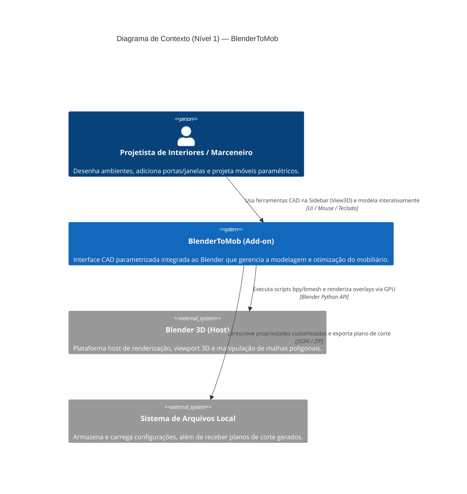

```mermaid
C4Context
    title Diagrama de Contexto (Nível 1) — BlenderToMob

    Person(designer, "Projetista de Interiores / Marceneiro", "Desenha ambientes, adiciona portas/janelas e projeta móveis paramétricos.")
    System(blendertomob, "BlenderToMob (Add-on)", "Interface CAD parametrizada integrada ao Blender que gerencia a modelagem e otimização do mobiliário.")
    System_Ext(blender, "Blender 3D (Host)", "Plataforma host de renderização, viewport 3D e manipulação de malhas poligonais.")
    System_Ext(filesystem, "Sistema de Arquivos Local", "Armazena e carrega configurações, além de receber planos de corte gerados.")

    Rel(designer, blendertomob, "Usa ferramentas CAD na Sidebar (View3D) e modela interativamente", "UI / Mouse / Teclado")
    Rel(blendertomob, blender, "Executa scripts bpy/bmesh e renderiza overlays via GPU", "Blender Python API")
    Rel(blendertomob, filesystem, "Lê/escreve propriedades customizadas e exporta plano de corte", "JSON / ZIP")
```
