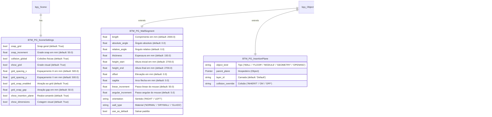

# Modelo Físico Completo (ERD) — BlenderToMob

Este documento apresenta a especificação detalhada de atributos, tipos e relações das entidades persistidas pelo add-on **BlenderToMob**:

```mermaid
erDiagram
    bpy_Scene ||--|| BTM_PG_SceneSettings : has
    bpy_Object ||--|| BTM_PG_WallSegment : extends
    bpy_Object ||--|| BTM_PG_InsertionPlane : extends
    bpy_Object ||--|| BTM_PG_OpeningProperties : extends
    bpy_Object ||--|| BTM_PG_CabinetProperties : extends
    
    BTM_PG_WallSegment {
        float length "Comprimento em mm (default: 2000.0)"
        float absolute_angle "Ângulo absoluto (default: 0.0)"
        float relative_angle "Ângulo relativo (default: 0.0)"
        float thickness "Espessura em mm (default: 150.0)"
        float height_start "Altura inicial em mm (default: 2700.0)"
        float height_end "Altura final em mm (default: 2700.0)"
        float offset "Elevação em mm (default: 0.0)"
        float sagitta "Arco flecha em mm (default: 0.0)"
        float linear_increment "Passo linear do mouse (default: 50.0)"
        float angular_increment "Passo angular do mouse (default: 5.0)"
        string orientation "Sentido ('RIGHT' / 'LEFT')"
        string wall_type "Material ('NORMAL' / 'DRYWALL' / 'GLASS')"
        bool use_as_default "Salvar padrão"
    }

    BTM_PG_InsertionPlane {
        string object_kind "Tipo ('WALL' / 'FLOOR' / 'MODULE' / 'GEOMETRY' / 'OPENING')"
        Pointer parent_plane "Hospedeiro (Object)"
        string layer_id "Camada (default: 'Default')"
        string collision_override "Colisão ('INHERIT' / 'ON' / 'OFF')"
    }

    BTM_PG_OpeningProperties {
        string opening_type "Tipo ('DOOR' / 'WINDOW')"
        float width "Largura em mm (default: 800.0)"
        float height "Altura em mm (default: 2100.0)"
        float sill_height "Peitoril em mm (default: 0.0)"
        Pointer parent_wall "Parede hospedeira (Object)"
    }

    BTM_PG_CabinetProperties {
        float width "Largura em mm (default: 800.0)"
        float height "Altura em mm (default: 700.0)"
        float depth "Profundidade em mm (default: 550.0)"
        float thickness "Espessura chapas em mm (default: 18.0)"
        string cabinet_type "Tipo ('BASE' / 'WALL' / 'TALL')"
    }

    BTM_PG_SceneSettings {
        bool snap_grid "Snap geral (default: True)"
        float snap_increment "Grade snap em mm (default: 50.0)"
        bool collision_global "Colisões físicas (default: True)"
        bool show_grid "Grade visual (default: True)"
        float grid_spacing_x "Espaçamento H em mm (default: 500.0)"
        float grid_spacing_y "Espaçamento V em mm (default: 500.0)"
        bool grid_snap_enabled "Atração ao grid (default: True)"
        float grid_snap_gap "Atração gap em mm (default: 50.0)"
        bool show_insertion_plane "Realce amarelo (default: True)"
        bool show_dimensions "Cotagem visual (default: True)"
    }
```
