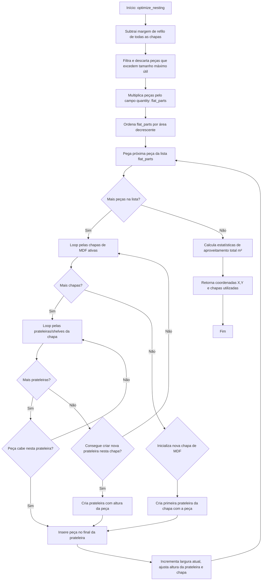

# Fluxograma do Módulo: Cutting

Este documento apresenta o fluxo algorítmico da otimização bidimensional de planos de corte do módulo **cutting**, no nível de documentação **Detalhado**.

---

## 1. Algoritmo de Nesting Bidimensional (`optimize_nesting`)

