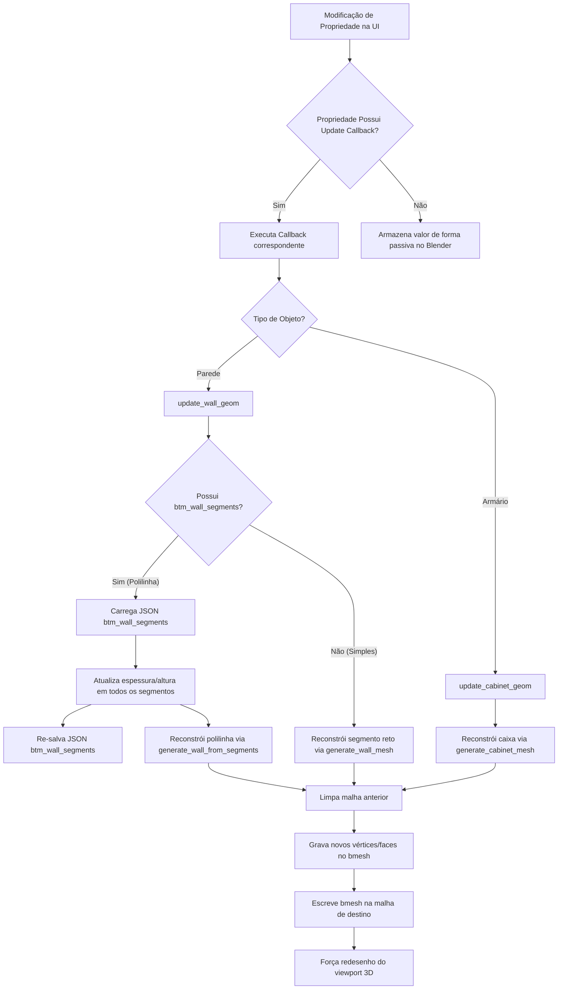

# Fluxograma do Módulo: Data

Este documento apresenta os diagramas de fluxo do ciclo de dados e reatividade de propriedades do módulo **data**, no nível de documentação **Detalhado**.

---

## 1. Fluxo de Reatividade e Atualização de Geometria

O diagrama abaixo ilustra o ciclo reativo que ocorre quando o usuário modifica uma propriedade paramétrica (como espessura ou pé-direito) no painel de propriedades:

