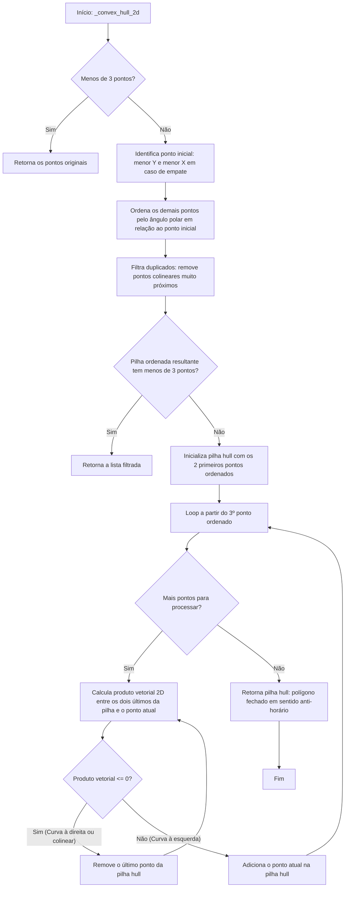

# Algoritmo de Convex Hull (Graham Scan)

Este documento apresenta a análise de fluxo detalhada da função de cálculo de fecho convexo 2D, utilizada pelo gerador automático de piso conformal:

```mermaid
flowchart TD
    A[Início: _convex_hull_2d] --> B{Menos de 3 pontos?}
    B -- Sim --> C[Retorna os pontos originais]
    B -- Não --> D[Identifica ponto inicial: menor Y e menor X em caso de empate]
    
    D --> E[Ordena os demais pontos pelo ângulo polar em relação ao ponto inicial]
    E --> F[Filtra duplicados: remove pontos colineares muito próximos]
    
    F --> G{Pilha ordenada resultante tem menos de 3 pontos?}
    G -- Sim --> H[Retorna a lista filtrada]
    G -- Não --> I[Inicializa pilha hull com os 2 primeiros pontos ordenados]
    
    I --> J[Loop a partir do 3º ponto ordenado]
    J --> K{Mais pontos para processar?}
    
    K -- Sim --> L[Calcula produto vetorial 2D entre os dois últimos da pilha e o ponto atual]
    L --> M{Produto vetorial <= 0?}
    M -- Sim (Curva à direita ou colinear) --> N[Remove o último ponto da pilha hull]
    N --> L
    M -- Não (Curva à esquerda) --> O[Adiciona o ponto atual na pilha hull]
    O --> J
    
    K -- Não --> P[Retorna pilha hull: polígono fechado em sentido anti-horário]
    P --> Q[Fim]
```
