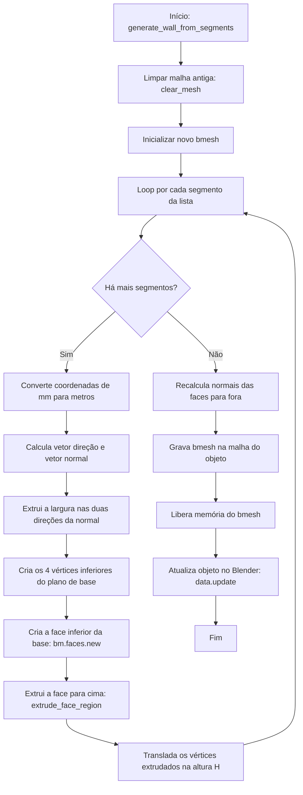

# Fluxograma do Módulo: Geometry

Este documento apresenta o fluxo de geração e modelagem poligonal paramétrica de baixo nível do módulo **geometry**, no nível de documentação **Detalhado**.

---

## 1. Geração Paramétrica de Parede

Ilustra o fluxo da função `generate_wall_from_segments`:

