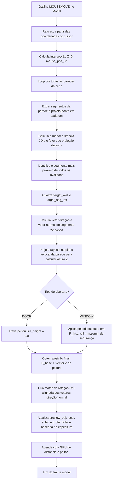

# Algoritmo de Posicionamento e Snapping de Aberturas

Este documento apresenta a análise de fluxo detalhada da lógica matemática e de interações utilizada no posicionamento, deslizamento e transição de portas/janelas nas paredes:


```
Fator de Projeção Linear (t):
P = A + t * (B - A)
t = (AP . AB) / |AB|^2  (clamped entre 0.0 e 1.0)
```
```
Cota GPU Visual:
Offset = normal_vector * offset_distance
A_off = A + Offset
B_off = B + Offset
P_off = P_door + Offset
```
