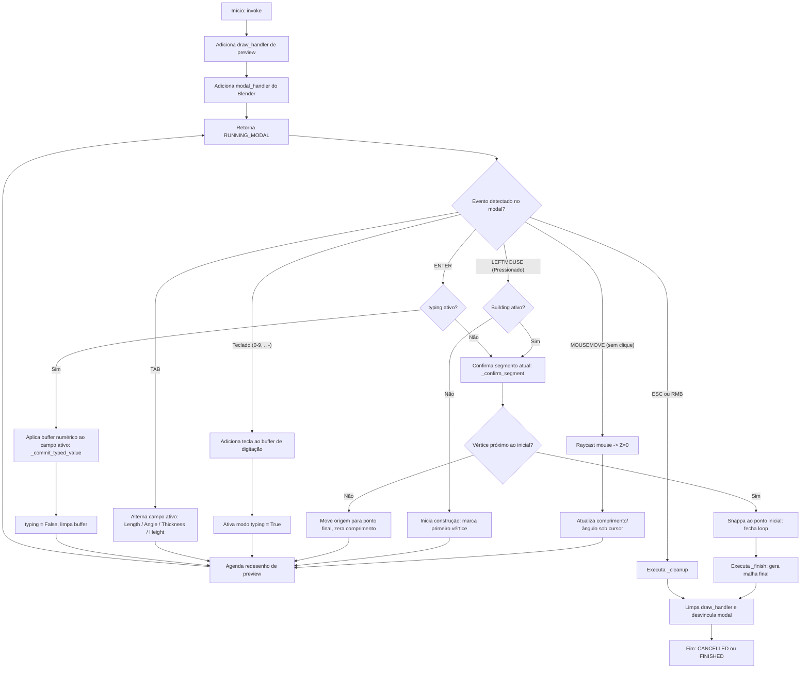

# Fluxograma do Módulo: Operators

Este documento apresenta o fluxo de orquestração de eventos modais do módulo **operators**, no nível de documentação **Detalhado**.

---

## 1. Loop Modal do Construtor de Parede (`BTM_OT_WallBuilder`)

Abaixo está o ciclo de vida do operador modal de paredes que captura interações em tempo real no 3D Viewport:

