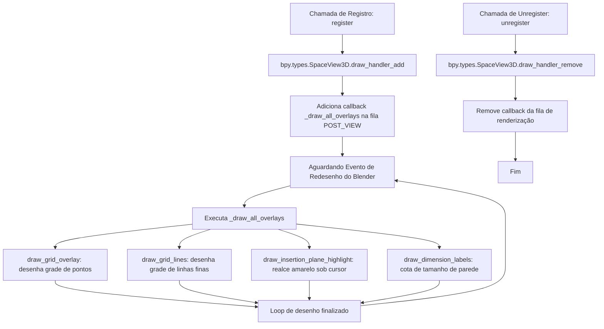

# Fluxograma do Módulo: Overlays

Este documento apresenta a integração do ciclo de desenho personalizado na GPU do módulo **overlays**, no nível de documentação **Detalhado**.

---

## 1. Ciclo de Desenho no Viewport 3D

O Blender redesenha a viewport continuamente. O módulo overlays injeta callbacks na fila de renderização do Blender 3D:

