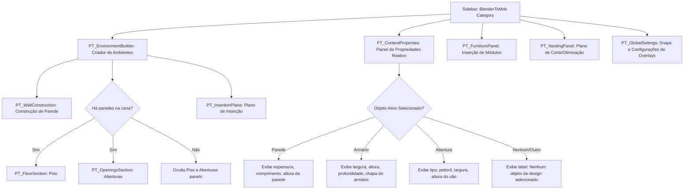

# Fluxograma do Módulo: UI

Este documento apresenta a estrutura de renderização em árvore do painel Sidebar do módulo **ui**, no nível de documentação **Detalhado**.

---

## 1. Hierarquia de Panels na Sidebar (BlenderToMob category)

Abaixo está o mapeamento de agrupamento visual e reatividade condicional do layout Sidebar:

