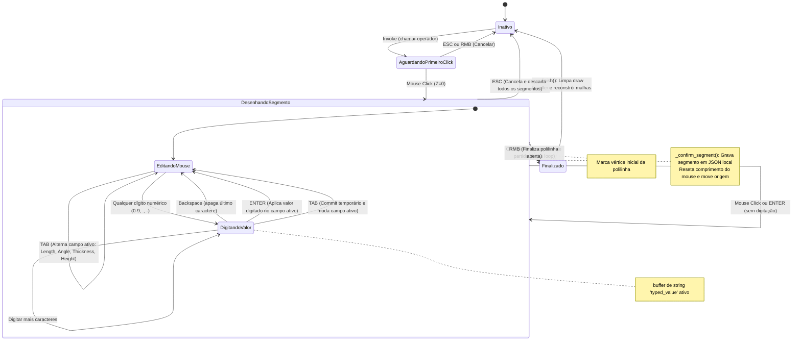
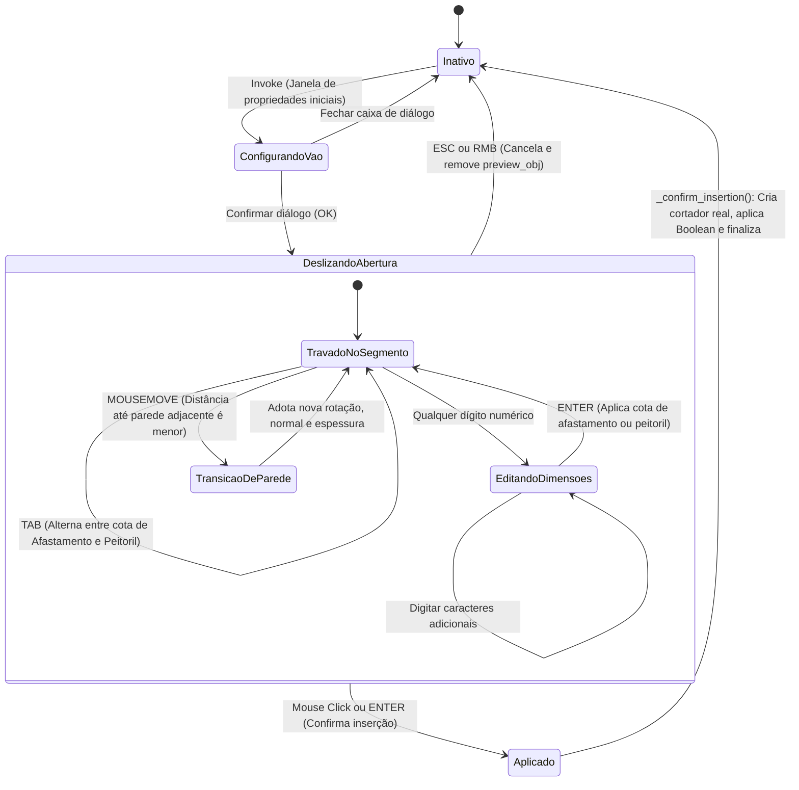

# Máquinas de Estado do Sistema — BlenderToMob

Este documento apresenta a especificação detalhada das máquinas de estado dos operadores modais e comportamentos dinâmicos do add-on **BlenderToMob**, conduzido pelo agente **Detective** no nível de documentação **Detalhado**.

---

## 1. Construtor de Parede Modal (`BTM_OT_WallBuilder`)

Esta máquina de estado gerencia a captura de coordenadas do cursor, buffer de entrada numérica via teclado e confirmação de segmentos polilinhas para geração geométrica final.

### 1.1 Diagrama de Estados (Mermaid)

---

## 2. Inserção de Aberturas interativa (`BTM_OT_InsertOpening`)

Esta máquina de estado controla o arrasto de portas e janelas nas paredes da cena, aplicando lógica de snapping 2D e peitoril vertical.

### 2.1 Diagrama de Estados (Mermaid)

