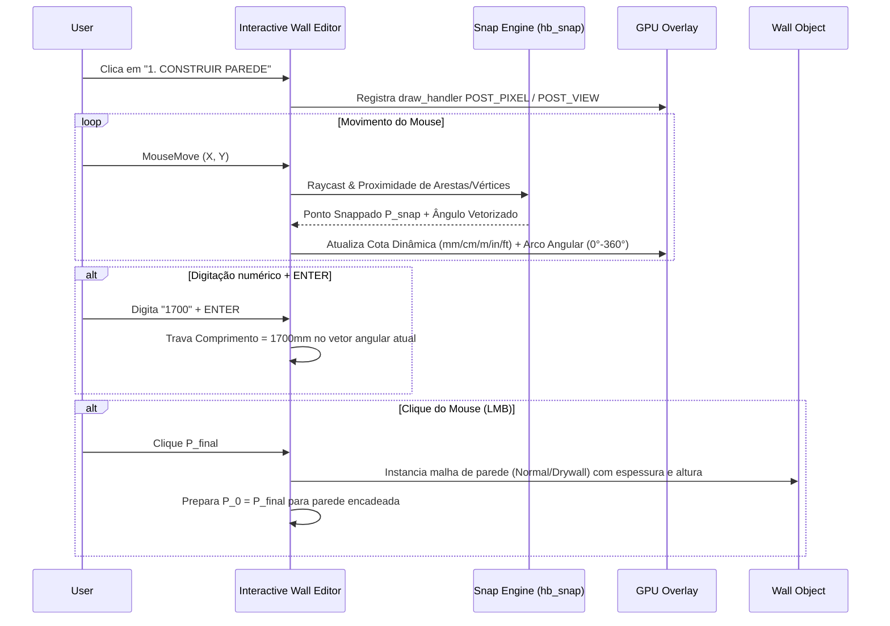

# Design do Módulo Wall Editor (Editor de Parede 🧱)

## Arquitetura e Componentes

### 1. Data Model & Property Groups (`hb_props.py` / `operators/walls.py`)
- **`HB_Wall_Editor_Props`** (PropertyGroup registrado no `Scene.hb_wall_editor`):
  - `unit_system`: EnumProperty (`['MM', 'CM', 'M', 'IN', 'FT']`, default `'MM'`)
  - `length`: FloatProperty (unit='LENGTH', default=units.mm(1700))
  - `height`: FloatProperty (unit='LENGTH', default=units.mm(2600))
  - `thickness`: FloatProperty (unit='LENGTH', default=units.mm(150))
  - `offset`: FloatProperty (unit='LENGTH', default=0.0)
  - `angle_absolute`: FloatProperty (unit='ANGLE', default=math.radians(270))
  - `angle_relative`: FloatProperty (unit='ANGLE', default=math.radians(270))
  - `orientation`: EnumProperty (`['RIGHT', 'LEFT']`, default `'RIGHT'`)
  - `step_linear`: FloatProperty (unit='LENGTH', default=units.mm(50))
  - `step_angular`: FloatProperty (unit='ANGLE', default=math.radians(45))
  - `wall_type`: EnumProperty (`['NORMAL', 'DRYWALL']`, default `'NORMAL'`)
  - `save_as_default`: BoolProperty (default=False)

### 2. Operador Modal de Desenho (`home_builder_walls_OT_interactive_wall_editor`)
- **Herança**: `bpy.types.Operator`, `hb_placement.PlacementMixin`.
- **Estados do Modal**:
  - `IDLE`: Aguardando primeiro clique (ponto inicial $P_0$).
  - `DRAWING`: Primeiro ponto definido; seguindo cursor para ponto final $P_1$.
  - `TYPING`: Buffer numérico ativo para digitação direta de comprimento na unidade selecionada.
- **Navegação TAB**:
  - Pressionar `TAB` alterna `active_input_field` na sequência: `LENGTH` -> `HEIGHT` -> `THICKNESS` -> `OFFSET` -> `ANGLE` -> `LENGTH`.

### 3. Visualização GPU Overlay (`hb_gpu_draw.py` / `draw_wall_editor_overlay`)
- Desenha a linha de cota dinâmica com texto formatado na unidade ativa (`units.format_length_unit(val, unit)`).
- Desenha arco indicador angular vetorizado na extremidade com o ângulo (ex: `270°`) e linha guia tracejada.
- Desenha retículo de snap magnético (ponto verde/amarelo ao travar na aresta ou vértice mais próximo).

### 4. Menu e UI Panel (`VIEW3D_PT_wall_editor_menu`)
- Botão no Viewport HUD / Sidebar: `Editor de Parede` `🧱`.
- Menu Dropdown:
  - Call `home_builder_walls_OT_interactive_wall_editor` (`1. CONSTRUIR PAREDE`).
  - Call `home_builder_walls_OT_wall_properties_panel` (`2. PAINEL GRÁFICO DE PROPRIEDADES`).

---

## Fluxo de Execução de Snapping & Cota

